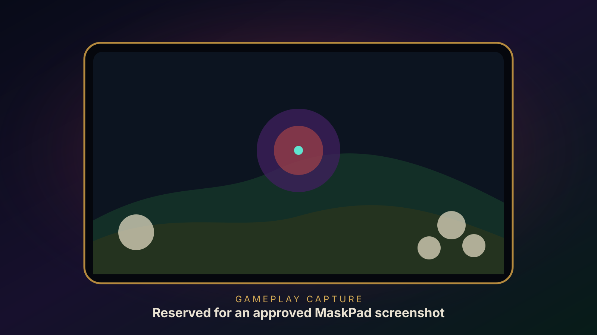
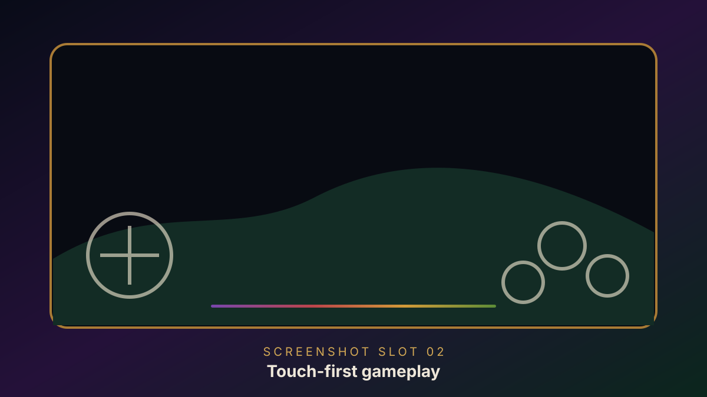
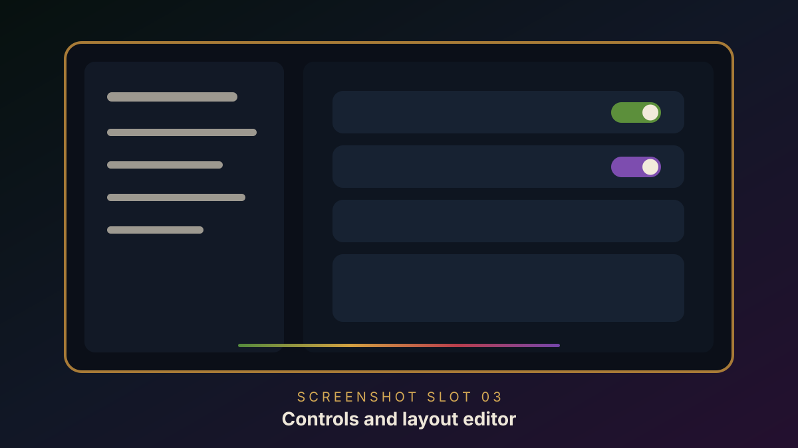
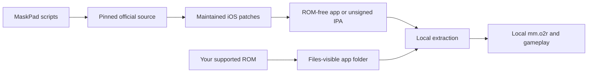

# MaskPad

<p align="center">
  <strong>Majora's Mask via 2 Ship 2 Harkinian, rebuilt for iPhone and iPad.</strong><br>
  Native Metal rendering, customizable touch controls, Files-based setup,
  and support for keyboards, pointing devices, and iOS game controllers.
</p>

<p align="center">
  <a href="https://github.com/chrissotraidis/maskpad/actions/workflows/ios-build.yml"></a>
  
  
  
  
  
</p>



MaskPad packages the full
[2 Ship 2 Harkinian](https://github.com/HarbourMasters/2ship2harkinian)
source port as a native landscape iOS/iPadOS app. It renders through Metal,
imports a user-provided supported Majora's Mask ROM through Files, and adds a
phone/tablet touch controller with movable, resizable, and hideable controls.

This repository contains the mobile integration and reproducible build
scripts. It does **not** contain Majora's Mask, a ROM, or a playable
ROM-derived archive. See the scoped
[`rights and licensing boundary`](RIGHTS_AND_LICENSES.md); it does not
relicense third-party projects or game material.

## Install status

| Option | Status | What to do |
|---|---|---|
| Local Simulator build | **Verified** | Best for development, import-flow checks, and UI testing. |
| Local device build | **Builds unsigned** | Configure your own Apple development team and bundle identifier before installation. |
| Unsigned `.ipa` | **Buildable locally** | Run the packaging script, then re-sign the result for your own device. No public binary release is currently published. |
| App Store / TestFlight | **Not announced** | No listing or public TestFlight currently exists. |

The current source has been exercised on iPhone 16 Pro and iPad Pro 11-inch
(M4) Simulators running iOS 18.5. ROM import, local archive generation,
gameplay, touch input, layout editing, separate phone/tablet persistence,
menu transitions, native HUD alignment, and background/foreground recovery
have been verified there.

Simulator proof is not physical-device acceptance. Audio routes, sustained
multi-touch ergonomics, controller reconnect, rumble, motion, performance,
thermals, signing, and in-place updates remain hardware gates.

## Get started

You need:

- an Apple Silicon Mac with Xcode and its command-line tools;
- Homebrew, CMake, Ninja, Git, Python 3, and network access; and
- your own legally acquired, supported Majora's Mask ROM for gameplay.

Install the host build dependencies:

```sh
brew install cmake ninja pkgconf sdl2 glew nlohmann-json libpng libzip \
  tinyxml2 libogg libvorbis opus opusfile sdl2_net
```

Clone and build:

```sh
git clone https://github.com/chrissotraidis/maskpad.git
cd maskpad

scripts/clone-sources.sh
scripts/apply-patches.sh

# Simulator
scripts/configure-ios.sh --simulator
scripts/build-ios.sh --simulator

# Generic unsigned iPhoneOS build
scripts/configure-ios.sh --device
scripts/build-ios.sh --device
```

The default products are:

```text
build-ios-simulator/mm/Release-iphonesimulator/MaskPad.app
build-ios-device/mm/Release-iphoneos/MaskPad.app
```

See [`docs/building.md`](docs/building.md) for installation, signing,
packaging, and audit commands. Before sharing a build, follow the
[`release checklist`](docs/release-checklist.md).

## First launch

MaskPad never downloads or bundles game data.

1. Launch MaskPad once so iOS creates its Files-visible folder.
2. Open **Files → On My iPhone/iPad → MaskPad**.
3. Copy one supported `.z64`, `.n64`, or `.v64` Majora's Mask ROM there.
4. Reopen MaskPad and leave it open while local extraction runs.
5. Later launches load the generated `mm.o2r` directly.

The ROM and generated archive stay inside the app's Documents container. They
are ignored by Git and rejected by the repository and package audits.

## Touch controls

MaskPad ports HarkinianPad's accepted landscape controller and customization
model instead of approximating it from screenshots:

- **Left:** separate D-pad, control stick, and Z within left-thumb reach.
- **Right:** Start, L/R, and transparent A/B/C targets aligned to the native
  Majora's Mask HUD.
- **Menu:** `•••` remains available when gameplay controls are hidden.
- **Customize:** move, resize from 70%–150%, hide/show, reset, and save
  separate normalized phone and tablet layouts.
- **Safety:** opening menus, editing, disabling controls, rebuilding the
  overlay, or backgrounding releases every held input.
- **Fallback:** Legacy Fixed Touch Controls keeps the non-customizable UIKit
  presentation.

| Touch control | 2S2H binding |
|---|---|
| Control stick | W/A/S/D, including diagonals |
| D-pad | T/F/G/H |
| A / B | X / C |
| L / Z / R | E / Z / R |
| Start | Space |
| C buttons | Arrow keys |
| Menu | Escape |

The ROM-free UI suite verifies every UIKit press/release path and the complete
layout editor. A separate user-data-gated suite observes the real
`PlayState.state.input[0].cur` state consumed by 2S2H gameplay. Both suites
pass on the representative iPhone and iPad Simulators.

See [`docs/controls.md`](docs/controls.md) for the full behavior contract and
[`docs/testing.md`](docs/testing.md) for the exact evidence.

## Current screenshots

<table>
  <tr>
    <td width="50%">
      
    </td>
    <td width="50%">
      
    </td>
  </tr>
  <tr>
    <td align="center"><strong>Touch-first gameplay</strong><br>Reserved for an approved iPad gameplay capture with the complete controller visible.</td>
    <td align="center"><strong>Adjust while running</strong><br>Reserved for the touch-layout editor or Controls settings on the current build.</td>
  </tr>
</table>

The gallery now follows HarkinianPad's hero-plus-two-capture rhythm. The
original placeholders keep the public tree free of copyrighted game imagery;
replace them only with captures the maintainer has explicitly approved.
The exact filenames, framing, and capture checklist live in
[`docs/readme/README.md`](docs/readme/README.md).

## What works

| Area | Current result |
|---|---|
| Native app | Full 2S2H app builds for arm64 iOS/iPadOS 14+ |
| Rendering | Metal gameplay renders in iPhone and iPad Simulators |
| Game setup | Files-visible ROM discovery and local `mm.o2r` generation work |
| Touch | Stick, D-pad, A/B/Z, C buttons, shoulders, Start, and persistent menu |
| Layout editor | Move, resize, hide/show, reset, safe-area clamp, and device-class persistence |
| Lifecycle | Input, audio queue, rendering, and configuration are safely suspended and restored |
| Input options | Touch plus existing keyboard, pointer, and SDL controller paths |
| Packaging | ROM, generated game data, signing material, and dependency-license audits |

For detailed evidence and remaining hardware checks, see
[`docs/remaining-work.md`](docs/remaining-work.md).

## Supported game

| Game | Engine | Status |
|---|---|---|
| **The Legend of Zelda: Majora's Mask** | [2 Ship 2 Harkinian](https://github.com/HarbourMasters/2ship2harkinian) | Supported with a compatible user-owned ROM |
| **The Legend of Zelda: Ocarina of Time** | [Ship of Harkinian](https://github.com/HarbourMasters/Shipwright) | Not supported by this app; see [HarkinianPad](https://github.com/chrissotraidis/harkinianpad) |

MaskPad is a native source-port integration, not a general Nintendo 64
emulator.

## Reproducible and ROM-free



The compile never reads your ROM. MaskPad pins 2S2H and each relevant
submodule, disables upstream push URLs, applies maintained patches, and
generates the ROM-free `2ship.o2r`. Your ROM is introduced only after app
installation.

Create and audit the unsigned package with:

```sh
scripts/package-unsigned-ipa.sh
scripts/verify-release.sh artifacts/MaskPad-0.1.0-unsigned.ipa
```

The IPA contains the project rights notice and discovered third-party license
files. It contains no maintainer certificate, provisioning profile, ROM, or
generated `mm.o2r`, and must be re-signed before standard-device installation.

## Frequently asked questions

<details>
<summary><strong>Where is the IPA?</strong></summary>

There is no public binary release yet. Build
`artifacts/MaskPad-0.1.0-unsigned.ipa` locally with the packaging command
above, then re-sign it using your own Apple account. See
[`docs/install-ipa.md`](docs/install-ipa.md).
</details>

<details>
<summary><strong>Does this repository include Majora's Mask?</strong></summary>

No. You must provide your own legally acquired supported ROM. Do not open
issues requesting game data or download links.
</details>

<details>
<summary><strong>Does audio work?</strong></summary>

The audio integration runs in Simulator and is paused/cleared across app
lifecycle transitions. Speaker, headphone, Bluetooth, interruption, and
route-change acceptance still require physical-device testing.
</details>

<details>
<summary><strong>Can I hide touch controls and get them back?</strong></summary>

Yes. The persistent `•••` button keeps the menu reachable. Open
**Settings → Controls** and toggle **Touch Controls**.
</details>

<details>
<summary><strong>Does it support controllers?</strong></summary>

2S2H's SDL controller path is compiled into the app. Physical controller
gameplay, reconnect, rumble, and motion remain device-specific verification
gates.
</details>

<details>
<summary><strong>Is this an App Store or TestFlight release?</strong></summary>

No. App Store, TestFlight, AltStore PAL, and other distribution channels have
different signing, review, account, and regional requirements.
</details>

<details>
<summary><strong>What is the licensing status?</strong></summary>

Each upstream component retains its own license and copyright. MaskPad-owned
integration code, scripts, documentation, artwork, and original patch content
are publicly readable but currently carry no license grant. MaskPad is
therefore source-available, not broadly redistributable open source. See
[`RIGHTS_AND_LICENSES.md`](RIGHTS_AND_LICENSES.md).
</details>

## Project map

| Path | Purpose |
|---|---|
| [`scripts/clone-sources.sh`](scripts/clone-sources.sh) | Fetch and assert pinned upstream revisions |
| [`scripts/build-ios.sh`](scripts/build-ios.sh) | Build the configured Simulator or device target |
| [`scripts/package-unsigned-ipa.sh`](scripts/package-unsigned-ipa.sh) | Unsigned IPA plus game-data and license audit |
| [`scripts/check-repo-safety.sh`](scripts/check-repo-safety.sh) | Fast tracked-asset, history, script, patch, link, and credential gate |
| [`patches/`](patches/) | MaskPad changes replayed onto pinned upstream source |
| [`docs/building.md`](docs/building.md) | Full build, installation, signing, and packaging guide |
| [`docs/install-ipa.md`](docs/install-ipa.md) | Personal re-signing and installation guide |
| [`docs/controls.md`](docs/controls.md) | Touch mapping, editor, Z latch, and native HUD contract |
| [`docs/testing.md`](docs/testing.md) | Exact Simulator, gameplay, build, and package evidence |
| [`docs/release-checklist.md`](docs/release-checklist.md) | Source and IPA publication gates |
| [`docs/remaining-work.md`](docs/remaining-work.md) | Evidence ledger and remaining physical gates |
| [`docs/readme/`](docs/readme/) | Approved screenshot slots and capture guidance |

Generated source trees, builds, artifacts, ROMs, and ROM-derived archives are
ignored and must never be committed.

## Contributing and support

Use the structured
[bug report](https://github.com/chrissotraidis/maskpad/issues/new/choose)
for reproducible platform defects. Read [`CONTRIBUTING.md`](CONTRIBUTING.md)
before proposing a change and [`SECURITY.md`](SECURITY.md) before reporting a
sensitive vulnerability. Never attach or request game data.

## Legal and acknowledgements

MaskPad is an unofficial community project and is not affiliated with or
endorsed by Nintendo or Harbour Masters. It does not provide the game, ROM
downloads, or playable ROM-derived data.

This project builds on 2 Ship 2 Harkinian, libultraship, ZAPDTR, OTRExporter,
the Majora's Mask decompilation project, SDL, and their contributors. All
projects, copyrights, and trademarks belong to their respective owners.
